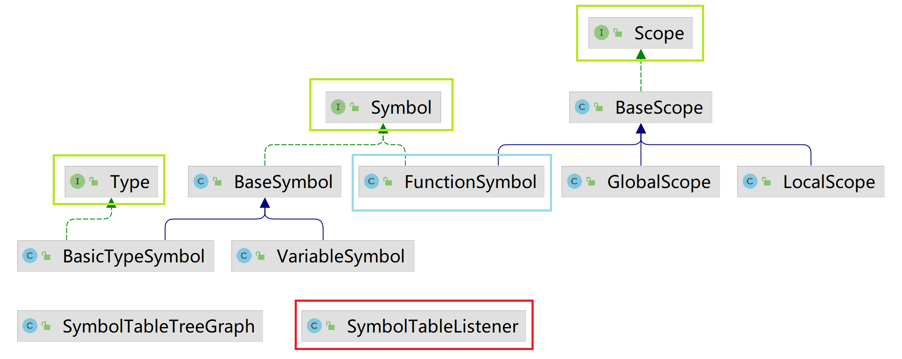

# Lab3 语义检查和重命名 实验报告

本实验需要完成对程序的语义检查以及对目标变量的重命名。

## 语义检查

语义检查部分，对于符号表和类型系统，我参考了魏老师代码仓库的设计，并使用 visitor 模式来对语法分析树进行遍历。

我编写了子类 SymTableVisitor 来继承 antlr 生成的 visitor 基类，并覆盖了那些会产生 11 类语义错误中的某些错误的节点的 visit 方法。对于每个 visit 方法，我使用 Type 类型作为返回值，这样根节点就能拿到左右子树表达式产生的类型，如果左右子树的表达式出错，就返回一个我自定义的 Error 类型。

在编写 visit 方法时，我主要考虑了如下问题:

1. **什么时候需要切换作用域?**

对于何时切换作用域，我的做法是，进入函数定义、代码块的时候开启新的作用域，在遍历完这些节点的时候退出作用域。

2. **什么时候定义符号?**

有以下几个地方会涉及符号定义:

- 普通的变量声明

- const 变量声明

- 函数定义中函数名和参数列表

3. **什么时候解析符号?**

有以下几个地方会涉及符号解析:

- terminal node

- 函数调用的函数名我是单独拿出来解析而不是向下遍历，因此这里也涉及符号解析。

上述的两种情况分别包含了对变量的使用和对函数的使用。

4. **如何体现 "最本质" 的错误?**

对于 "最本质" 的错误，我的理解是，不报那些由于语法分析树更深处传递上来的错误引发的错误。比如对于 `int a = b + c` 这个语句，其中 b 和 c 是未定义的变量，这里只报 b 和 c 未定义两个错，加法这个节点上不会报错，当子树传递上来的类型是 Error，我们默认类型正确，不进行检查。

## 重命名

对于重命名我采取了一种较为朴素的实现，在生成符号表的时候我记录了每个符号和它的所有的使用点的 lineNumber 和 charIndexInLine.

在遍历打印的时候，对于每个 terminal node，我检查它的 lineNumber 和 charIndexInLine 对应的 symbol 是否和目标的 symbol 相同，如果相同则打印新的名字。